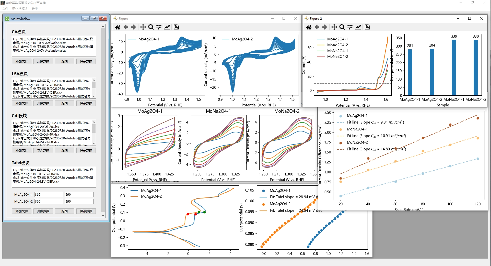

# Machine-Learning-Toolkit

Electrochemical Data Analysis ToolKit: An efficient and specialized tool for rapid analysis and processing of data from Autolab Electrochemical Workstations. Designed to streamline electrochemical research, this toolkit offers seamless integration with Autolab formats, enabling quick import, analysis, visualization, and interpretation of electrochemical data. It features automated data cleaning, advanced statistical tools, and customizable visualization options, making it a vital asset for electrochemists, researchers, and students who regularly work with Autolab instruments. Enhance your electrochemical data processing with precision and ease.

<div class="language-selector">
  <a href="README.md">中文</a>
  <a href="README-EN.md">English</a>
</div>



## Table of Contents

- [Project Introduction](#project-introduction)
- [Main Features](#main-features)
- [Dependencies](#dependencies)
- [Project Structure](#project-structure)
- [Installation](#installation)
- [Usage](#usage)
- [Contributors](#contributors)
- [License](#license)
- [Acknowledgments](#acknowledgments)

## Project Introduction

Machine Learning Toolkit is a GUI framework for implementing various machine learning algorithm predictions. It allows predictions using various common algorithms in regression, classification, clustering, and dimensionality reduction. This project is written using the PyQt5 framework and Python language, featuring the following main functionalities:

## Main Features

- Electrochemical Data Analysis ToolKit offers a range of powerful features specifically for the analysis, processing, and visualization of electrochemical test data, including Cyclic Voltammetry (CV), Linear Sweep Voltammetry (LSV), Double Layer Capacitance (Cdl), and Tafel analysis.

## Dependencies

- Python 3.x
- Python package dependencies can be found in the requirements.txt file

## Project Structure

The file structure of the project should be as follows:

```
Electrochemical-Data-Analysis-ToolKit
├── pycache: Automatically generated folder after Python compilation, containing compiled Python files.
├── images: Image folder for storing pictures and icons used in the software.
├── main.py: The main program file, the entry point of the software.
├── main.ui: UI design file for the main interface, created by Qt Designer.
├── FunctionWindow.ui: UI design file for the function window, created by Qt Designer.
├── Ui_FunctionWindow.py: Python code file generated from FunctionWindow.ui to implement the function window interface.
├── Ui_main.py: Python code file generated from main.ui to implement the main interface.
├── resources.qrc: Resource file defining resources used in the UI.
├── resources_rc.py: Python resource file generated from resources.qrc.
├── UpdateLog.md: Update log file, recording the version update history of the software.
├── test.ipynb: Jupyter notebook file for testing and demonstrating software functionalities.
├── test2.py: Auxiliary test script file.
├── README-EN.md: Project introduction file (English version), providing detailed information and usage guidelines.
├── README.md: Project introduction file (Chinese version), providing detailed information and usage guidelines.
├── LICENSE: Software license file, specifying the terms and conditions for use and distribution.
```


## Installation

1. Clone the repository to local:

```bash
git clone https://github.com/liyihang1024/Electrochemical-Data-Analysis-ToolKit.git
```

2. Enter the project directory:

```bash
cd Electrochemical-Data-Analysis-ToolKit
```

3. Install dependencies:

```bash
pip install -r requirements.txt
```

4. Run the project:

```bash
python main.py
```

## Usage
- To be completed

## Contributors

- [Yihang Li](https://www.x-mol.com/groups/flygroup/people/18563)

We warmly welcome contributions to this project. If you encounter any problems or have suggestions, please submit them through Issues or Pull Requests for changes.

## License

This project is released under the MIT License, permitting anyone to use, copy, modify, merge, publish, distribute, sublicense, and/or sell copies of this software, subject to the following conditions:

- Include copyright and permission notices in the software and documentation.
- All copies must include the above copyright and permission notices.
- The names of the authors, trademarks, or other forms of recognition should not be used to promote or advertise the software without specific prior written permission.

## Acknowledgments

We would like to thank the following open-source projects and libraries for their assistance and support in the development and implementation of this project:

- Pyside6
- Pandas
- Matplotlib

If you like this project, please give us a star for support, thank you!
