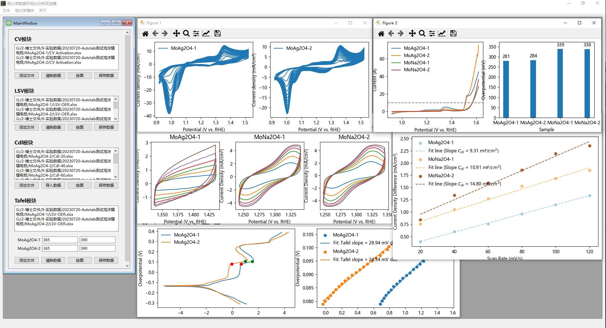

# Electrochemical-Data-Analysis-ToolKit
电化学数据分析工具包：一个高效专业的工具，专为Autolab电化学工作站测试数据的快速分析和处理而设计。该工具包旨在简化电化学研究流程，提供与Autolab格式的无缝集成，使得数据快速导入、分析、可视化和解读成为可能。它具备自动数据清洗功能、先进的统计工具和可定制的可视化选项，是经常使用Autolab电化学工作站的电化学家、研究人员和学生的重要助手。使用我们的工具包，使您的电化学数据处理更加精准和便捷。

<div class="language-selector">
  <a href="README.md">中文</a>
  <a href="README-En.md">English</a>
</div>



## 目录

- [项目介绍](#项目介绍)
- [主要功能](#主要功能)
- [依赖条件](#依赖条件)
- [项目内容](#项目内容)
- [安装](#安装)
- [使用](#使用)
- [贡献者](#贡献者)
- [许可证](#许可证)
- [致谢](#致谢)


## 项目介绍

Machine Learning Toolkit 是一个用于实现各种机器学习算法预测的GUI框架，可以使用各种机器学习算法对数据进行预测，支持常见的回归、分类、聚类和降维算法。该项目使用 PyQt5 框架和 Python 语言编写，具有以下主要功能：

## 主要功能

- Electrochemical Data Analysis ToolKit 提供了一系列强大的功能，专门针对电化学测试数据的分析、处理和可视化，包括循环伏安法（CV）、线性扫描伏安法（LSV）、双电层电容（Cdl）和Tafel分析等。

## 依赖条件

- Python 3.x

- Python包依赖请参见 requirements.txt 文件

## 项目内容

项目中的文件结构应该是这样：

```
Electrochemical-Data-Analysis-ToolKit
├── __pycache__：Python编译后自动生成的文件夹，包含编译的Python文件。
├── images：图像文件夹，用于存放软件中使用的图片和图标。
├── main.py：主程序文件，软件的入口点。
├── main.ui：主界面的UI设计文件，由Qt Designer创建。
├── FunctionWindow.ui：功能窗口的UI设计文件，由Qt Designer创建。
├── Ui_FunctionWindow.py：由FunctionWindow.ui生成的Python代码文件，用于实现功能窗口的界面。
├── Ui_main.py：由main.ui生成的Python代码文件，用于实现主界面的界面。
├── resources.qrc：资源文件，定义了UI中使用的资源。
├── resources_rc.py：由resources.qrc生成的Python资源文件。
├── UpdateLog.md：更新日志文件，记录软件的版本更新历史。
├── test.ipynb：Jupyter笔记本文件，用于测试和演示软件功能。
├── test2.py：辅助测试脚本文件。
├── README-EN.md：项目介绍文件（英文版），提供项目的详细信息和使用指南。
├── README.md：项目介绍文件（中文版），提供项目的详细信息和使用指南。
├── LICENSE：软件的许可证文件，说明使用和分发的条款和条件。
```

## 安装

1. 克隆仓库到本地：

```bash
git clone https://github.com/liyihang1024/Electrochemical-Data-Analysis-ToolKit.git
```

2. 进入项目目录：

```bash
cd Electrochemical-Data-Analysis-ToolKit
```

3. 安装依赖：

```bash
pip install -r requirements.txt
```

4. 运行项目：
```bash
python main.py
```

## 使用

- 待完善

## 贡献者

- [Yihang Li](https://www.x-mol.com/groups/flygroup/people/18563)

我们非常欢迎您为该项目做出贡献。如果您发现了任何问题或有任何建议，请在 Issues 中提交问题或 Pull Request 进行更改。

## 许可证

该项目基于 MIT 许可证 发布，允许任何人使用、复制、修改、合并、出版、分发、再许可和/或销售本软件的副本，但需遵守以下条件：

- 在软件和文档中包含版权声明和许可声明。
- 在所有的副本中都包含上述版权声明和许可声明。
- 不得使用作者的名字、商标或其他形式的认可来促销或推广本软件。

## 致谢

我们感谢以下开源项目和库，它们对该项目的开发和实现提供了帮助和支持：

- Pyside6

- Pandas


- Matplotlib

如果您喜欢该项目，请给我们一个star支持，谢谢！
